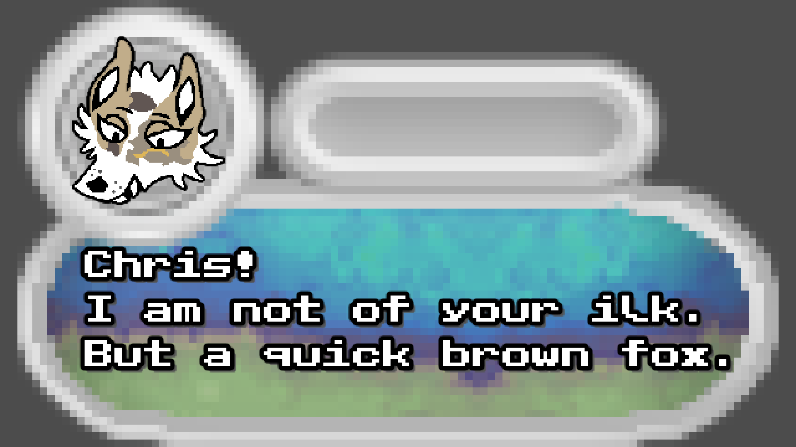

## Gallery/Preview

---

## Progress Tracker

- [ ] (0/4%) <ins>Full release?</ins>
- [ ] (0/4%) <ins>Demo phase?</ins>
- [x] (1/4%)**\*\*** <ins>Discovery phase?</ins>
- [ ] (0/4%) <ins>Playable state?</ins>
- [x] (1/4%)**\*\*** <ins>Has an art direction?</ins> (By Yukikessho & ElijahD)
- [x] (1/4%)**\*\*** <ins>Collaboration?</ins> ([@QuantumChemist](https://github.com/QuantumChemist),
                                     Yukikessho,
                                     Luminartity)
- [x] (2/4%)**\*\*** <ins>Story?</ins> (By Alendrone Games)

---

## Attributions

- [**Godot**](https://github.com/godotengine) **(game engine)**
- [**Jenova™**](https://github.com/Jenova-Framework) **(C++ framework)**
- **Alendrone Games** __(developer(__***s***__)*)*__
### Especial Thankyous 
     William Candy (Inspirations)
     Crimson Legend (Inspirations)
     Luminarity (Creator of Moxy/Moxhi)

---

# [In Search for Yaeohi](https://game.trifect.show)
**(Trifect Series)**

A __2.5D adventure game__ that takes a snapshot into **4,051 years ago** ***from the*** ***year 2038***.

__"Viridus"__, known today as *The
Chihuahuan Desert*,  starting to live up to its current name, *now becoming* arid and dry after the death of A BYGONE EVIL that *had previously* given the land its sprawl of life.

The AZURIAN people that inhabited the region were responsible for the _EXTINCTION_ of species and these lasting effects are still felt by the world, *standing to reason why* history goes unrecounted in time's heedless march.

Play together as ***Primrose, Moxhi, and Laggas,*** each possessing abilities to afflict upon this age-old wound that's __been unable to bleed.__

> ***The question remains with you.***
> "Will you consume nature, or grant nature's eternal wish to grow past maturity, and leave you behind?"

---

## License

[CC0 1.0 Universal](https://creativecommons.org/publicdomain/zero/1.0/deed.en/)

---
